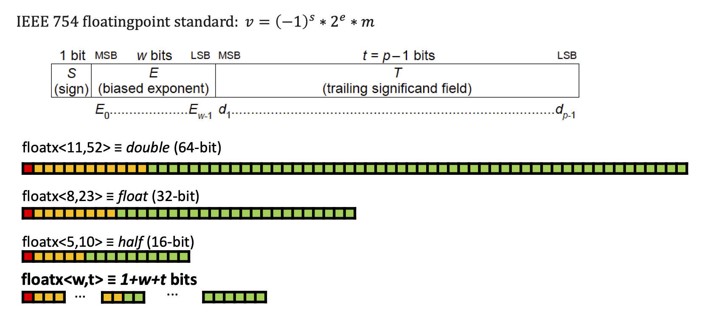

FloatX (Float eXtended)
=======================

FloatX is a header-only C++ library which extends floating point types beyond
the native single and double (and on some hardware half) precision types. It
provides template types which allow the user to select the number of bits used
for the exponent and significand parts of the floating point number.
The idea of FloatX is based on the FlexFloat library, but, instead of
implementing the functionality in C and providing C++ wrappers, FloatX is
written completely in C++, which makes it more natural to the end user.
In addition, FloatX provides a superset of FlexFloat's functionalities.





Features
--------

This section lists the functionalities provided by FloatX. Functionalities that
are also provided by FlexFloat have (_flexfloat_) appended to the description.

*   header-only library, without a compiled component, and heavy inlining,
    resulting in relatively high performance
*   `floatx<exp_bits, sig_bits, backend_float>` class template, which allows
    emulation of non-native types with `exp_bits` exponent bits and `sig_bits`
    significand bits using a natively supported `backend_float` type to perform
    arithmetic operations (_flexfloat_ - provides a similar functionality in
    the C++ wrapper, but the memory consumption of the flexfloat C++ class was
    suboptimal).
*   `floatxr<backend_float>` class template, which provides the same
    functionality as `floatx`, but allows changing the precision of the type
    at runtime. This class is easier to experiment with, but is not as
    efficient as `floatx` in both the performance, as well as the memory
    consumption. (_flexfloat_ - provides a type that has a comparable memory
    consumption with the precision selectable at runtime in the C library only)
*   conversions between builtin types and `floatx`
    (_flexfloat_ - had a bug where NaN can be cast to Inf during conversion)
*   assignments on `floatx` and `floatxr` types (_flexfloat_)
*   relational operations on `floatx` and `floatxr` types
    (_flexfloat_ - did not handle NaN properly)
*   relational operations between different types
*   arithmetic operations on `floatx` and `floatxr` types (_flexfloat_)
*   arithmetic operations between different types with implicit type promotion
*   `std::ostream& operator <<(std::ostream&, floatx[r])` (_flexfloat_)
*   `std::istream& operator >>(std::istream&, floatx[r])`
*   CUDA support


What FloatX is NOT
------------------

FloatX does not implement arbitrary floating point types. The only supported
types are "subtypes" of those natively supported by the hardware.
In case you need implementations of larger types, consider using the SoftFloat
library.

FloatX __emulates__ the types of custom precision, subject to the constraints
above, and, while trying to achieve as high performance as possible, it is
__not__ capable of magically delivering better performance than natively
supported types. Thus, do not expect `floatx<3, 3>` to consume less memory, or
be faster than e.g. `float`, though `floatx<11, 52>` should deliver similar
performance as `double`.

That being said, it is not likely that FloatX will be useful in production
codes. On the other hand, it can be handy in research projects which aim to
study the effects of using different precisions.

Installation
------------

To use the library, just make sure that a directory containing `floatx.hpp` is
in your include path (here, it is in `src/` subdirectory).

Alternatively, if you are using CMake, a `CMakeLists.txt` file is provided.
You can download the repository into your project and use the following code to
depend on the floatx target:

```
add_subdirectory(floatx)
target_add_library(my_target PRIVATE floatx)
```

### Building the examples / unit tests

A standard CMake command line sequence should do:

```
mkdir build && cd build && cmake .. && make
```

To run all the tests:

```
make test
```

This will (hopefully) output a summary of the form:

```
test_<testname>............ Passed
```

To run only one of the tests (and see more detail output):

```
./test/<testname>
```


Examples
--------

Some sample code using floatx:
```
1:  flx::floatx<7, 12> a = 1.2; // 7 exponent bits , 12 sign . bits
2:  flx::floatx<7, 12> b = 3; // 7 exponent bits , 12 sign . bits
3:  flx::floatx<10, 9> c; // 10 exponent bits , 9 sign . bits
4:  float d = 3.2;
5:  double e = 5.2;
6:
7:  std :: cin >> c;
8:  c = a + b; // decltype (a + b) == floatx <7, 12>
9:  bool t = a < b;
10:  a += c;
11:  d = a / c; // decltype (a / c) == floatx <10 , 12>
12:  e = c - d; // decltype (c - d) == floatx <10 , 23>
13:  c = a * e; // decltype (a * e) == floatx <11 , 52>
14:  std :: cout << c;
```

Lines 1, 2, and 3 show how floatx numbers can be constructed
from built-in types (floating-point numbers and integers) and read
from C++ streams. Lines 8 and 9 show how these objects are used
to perform basic arithmetic and relational operations. Lines 10-13
demonstrate the interoperability between different floatx and built-in
types. The comments on the right specify the return type of the
operation. Note, that T == U, where T and U are types, is used to
convey that these two types are the same, i.e., that std::is_same<T,
U>::value evaluates to true. Lines 8 and 11-13 also show that floatx
types can be implicitly converted to other floatx types or built-in
types. Finally, line 14 shows how floatx types can be written to an
output stream.


## Authors and contacts
 - Goran Flegar, Departamento de Ingeniería y Ciencia de Computadores, Universidad Jaime I, Spain, flegar@uji.es
 - Florian Scheidegger, IBM Research - Zurich, eid@zurich.ibm.com
 - Vedran Novakovic, Departamento de Ingeniería y Ciencia de Computadores, Universidad Jaime I, Spain
 - Giovani Mariani, IBM Research - Zurich,
 - Andres E. Tomas, Departamento de Ingeniería y Ciencia de Computadores, Universidad Jaime I, Spain,tomasan@uji.es
 - A. Cristiano I. Malossi, IBM Research - Zurich, acm@zurich.ibm.com
 - Enrique S. Quintana-Orti, Departamento de Informática de Sistemas y Computadores,Universitat Politècnica de València, Spain, quintana@icc.uji.es


## Reference

The full text of our paper explaining floatx in datail is available under the following link: https://dl.acm.org/doi/pdf/10.1145/3368086?download=true.

Please, if you like and use our work, cite our paper as follows:

```
@article{flegar2019floatx,
author={Flegar, Goran and Scheidegger, Florian and Novakovi{\'c}, Vedran and Mariani, Giovani and Tom{\'{}} s, Andr{\'e}s E and Malossi, A Cristiano I and Quintana-Ort{\'\i}, Enrique S},
 title = {FloatX: A C++ Library for Customized Floating-Point Arithmetic},
 year = {2019},
 issue_date = {December 2019},
 publisher = {Association for Computing Machinery},
 address = {New York, NY, USA},
 volume = {45},
 number = {4},
 issn = {0098-3500},
 url = {https://doi.org/10.1145/3368086},
 doi = {10.1145/3368086},
 journal={ACM Transactions on Mathematical Software (TOMS)},
 month = dec,
 articleno = {Article 40},
 numpages = {23},
}
```

## Acknowledgments

This work was funded by the European Union’s H2020 research and innovation program under grant
agreement No 732631, project OPRECOMP.

For details visit http://oprecomp.eu/. 


